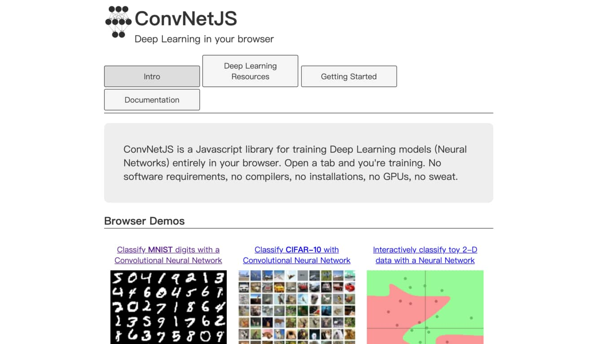

# 深度學習資源 Deep Learning Resources
這裡紀錄了在我學習 [Deep Learning](https://zh.wikipedia.org/wiki/%E6%B7%B1%E5%BA%A6%E5%AD%A6%E4%B9%A0) 的路上蒐集到的線上資源，希望能幫助到想了解這領域的你：）

## 遊樂場 Playground
這裡列舉一些透過瀏覽器就能開始遊玩 / 體驗 / 學習 Deep Learning 的 App 及網站。

|[Deep Playground](https://playground.tensorflow.org/)|[ConvNetJS](https://cs.stanford.edu/people/karpathy/convnetjs/index.html)|
|:-------------------------:|:-------------------------:|
||

- [Deep Playground](https://playground.tensorflow.org/)
    - 由 [Tensorflow 團隊](https://github.com/tensorflow/playground)推出，模擬訓練一個[類神經網路](https://zh.wikipedia.org/wiki/%E4%BA%BA%E5%B7%A5%E7%A5%9E%E7%BB%8F%E7%BD%91%E7%BB%9C)的過程並了解其運作原理
    - 可以搭配這篇 [Introduction to Neural Networks: Playground Exercises](https://developers.google.com/machine-learning/crash-course/introduction-to-neural-networks/playground-exercises)學習
- [ConvNetJS](https://cs.stanford.edu/people/karpathy/convnetjs/)
    - 訓練類神經網路來解決經典的 [MNIST 手寫數字辨識問題](https://cs.stanford.edu/people/karpathy/convnetjs/demo/mnist.html)、[圖片生成](https://cs.stanford.edu/people/karpathy/convnetjs/demo/image_regression.html)以及[增強式學習](https://cs.stanford.edu/people/karpathy/convnetjs/demo/rldemo.html)
    - 由 [特斯拉汽車 Tesla](https://www.tesla.com/zh_TW/) 的 AI 負責人 [Andrej Karpathy](https://cs.stanford.edu/people/karpathy/) 建立

|[Magenta](https://magenta.tensorflow.org/)|[Quick Draw](https://quickdraw.withgoogle.com/)|
|:-------------------------:|:-------------------------:|
||

- [Magenta](https://magenta.tensorflow.org/) 
    - 一個嘗試利用[機器學習](https://zh.wikipedia.org/zh-hant/%E6%9C%BA%E5%99%A8%E5%AD%A6%E4%B9%A0)來協助人們進行音樂以及藝術創作的專案
    - 可以在網站上的 [Demo 頁面](https://magenta.tensorflow.org/demos) 實際使用各種由深度學習技術驅動的互動式音樂 / 繪畫應用（如彈奏鋼琴、擊鼓）
- [Quick Draw](https://quickdraw.withgoogle.com/)
    - 由 Google 推出的知名手寫塗鴉辨識。深度學習模型會不斷將你的筆觸當作輸入來預測你想畫的物件，你會被她快速且精準的判斷嚇到

## 線上教材 Courses / Tutorials

在看過上面的遊樂場以後，我相信你會有些 idea 想要實現，這時候你會需要理論 / 程式基礎

- [Colaboratory](https://colab.research.google.com/notebooks/welcome.ipynb)
    - A hosted Jupyter notebook environment that is free to use and requires no setup. Used to demonstrate the 
- seedbank

| | |
|:-------------------------:|:-------------------------:|
|      | <a href="https://cs.stanford.edu/people/karpathy/convnetjs/index.html" target="_blank">ConvNetJS</a>    

## Framework

## 實用工具

- Colab

## 部落格

## Newsletter

## Colab notebook

## Terminology
- leemeng.tw/dl-terminology.html

  

