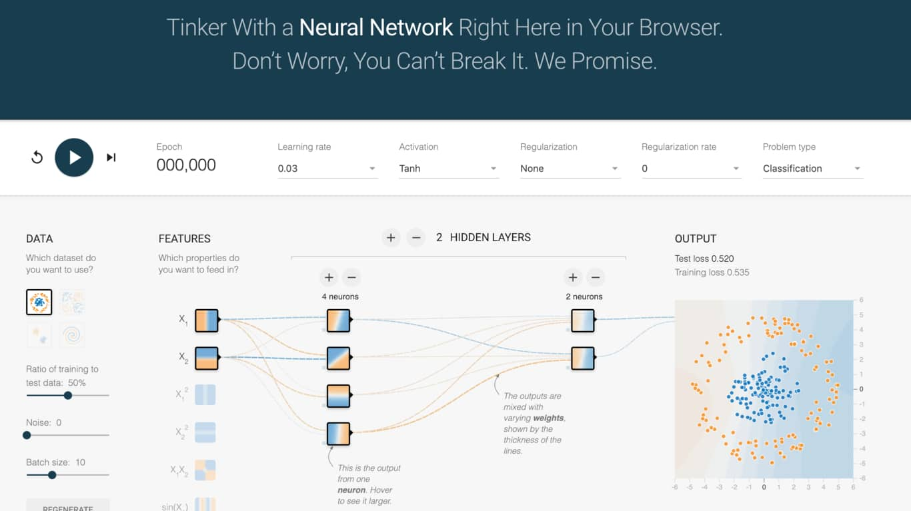

# 深度學習資源 Deep Learning Resources
這裡紀錄了在我學習 Deep Learning 的路上發現的一些線上資源，希望能幫助到更多想了解這領域的你：）

## 遊樂場 Playground
這裡列舉那些讓你透過瀏覽器就能開始遊玩 / 體驗 / 學習 Deep Learning 的 App 及網站。

| | |
|:-------------------------:|:-------------------------:|
|<a href="https://playground.tensorflow.org/" target="_blank">Deep Playground</a>      | <a href="https://cs.stanford.edu/people/karpathy/convnetjs/index.html" target="_blank">ConvNetJS</a>    

- [Deep Playground](https://playground.tensorflow.org/)
    - 由 [Tensorflow 團隊](https://github.com/tensorflow/playground)推出，模擬訓練一個[神經網路](https://zh.wikipedia.org/wiki/%E4%BA%BA%E5%B7%A5%E7%A5%9E%E7%BB%8F%E7%BD%91%E7%BB%9C)並透過視覺化了解其運作原理
    - 可以搭配 [Google 的 ML 教學](https://developers.google.com/machine-learning/crash-course/introduction-to-neural-networks/playground-exercises)開始學習
- [ConvNetJS](https://cs.stanford.edu/people/karpathy/convnetjs/)
    - 訓練神經網路來解決經典的 [MNIST 手寫數字辨識問題](https://cs.stanford.edu/people/karpathy/convnetjs/demo/mnist.html)、[圖片生成](https://cs.stanford.edu/people/karpathy/convnetjs/demo/image_regression.html)以及[增強式學習](https://cs.stanford.edu/people/karpathy/convnetjs/demo/rldemo.html)
    - 由 [Tesla](https://www.tesla.com/zh_TW/) 的 AI 負責人 [Andrej Karpathy](https://cs.stanford.edu/people/karpathy/) 建立

https://developers.google.com/machine-learning/crash-course/introduction-to-neural-networks/playground-exercises

## 學習資源

在看過上面的遊樂場以後，我相信你會有些 idea 想要實現，這時候你會需要理論 / 程式基礎

- [Colaboratory](https://colab.research.google.com/notebooks/welcome.ipynb)
    - desc

| | |
|:-------------------------:|:-------------------------:|
|      | <a href="https://cs.stanford.edu/people/karpathy/convnetjs/index.html" target="_blank">ConvNetJS</a>    

## Framework

## 實用工具

- Colab

## 部落格

## Newsletter

## Colab notebook

## Terminology
- leemeng.tw/dl-terminology.html

  

